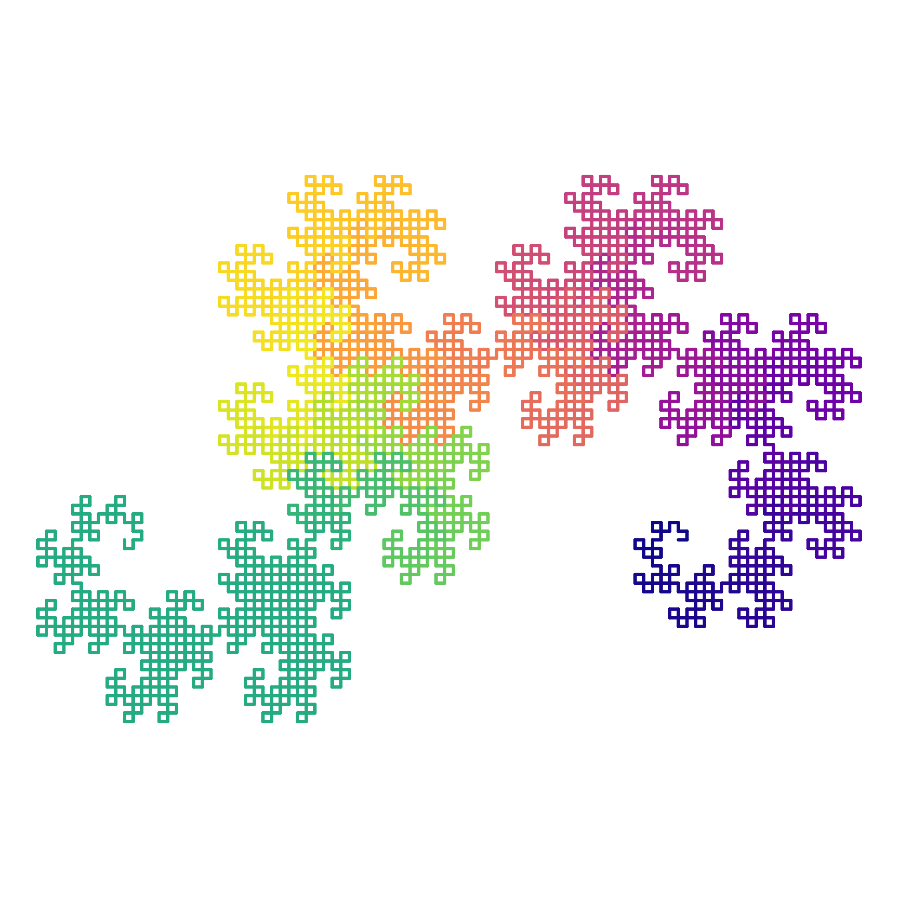
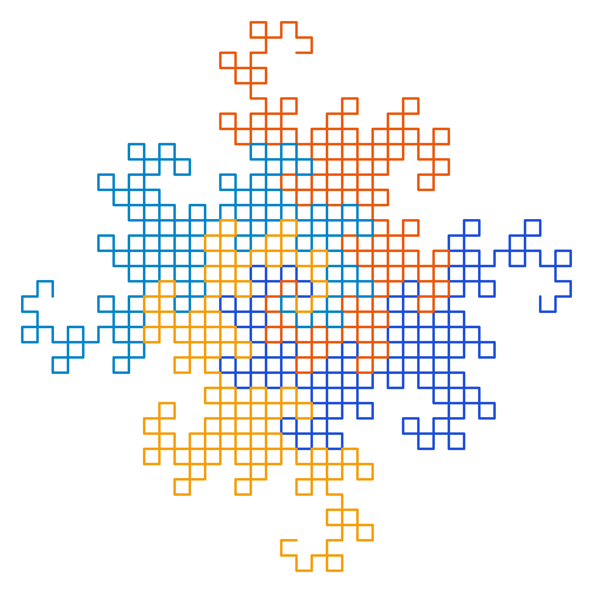
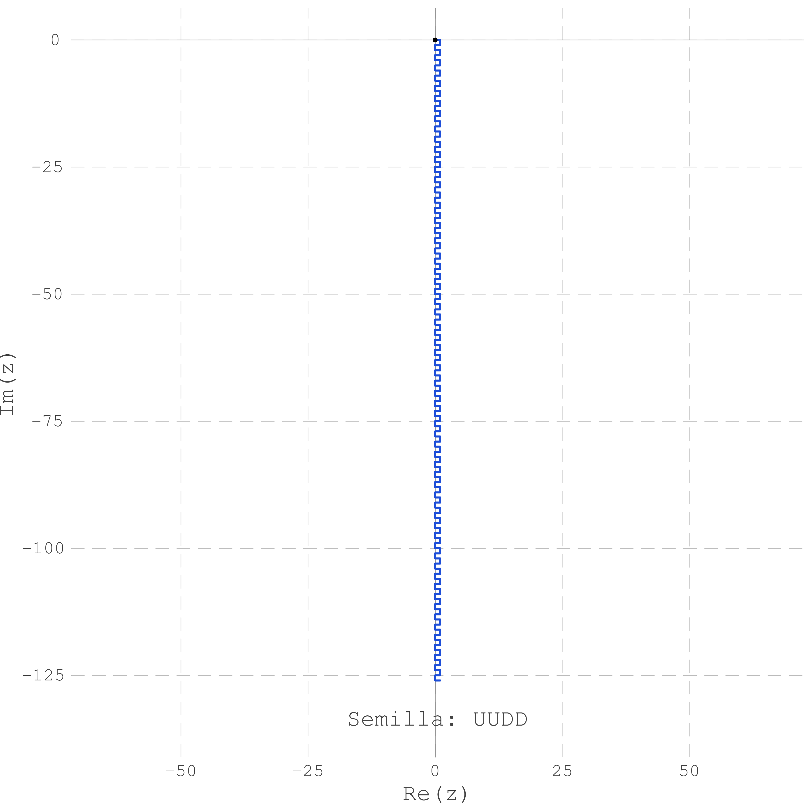
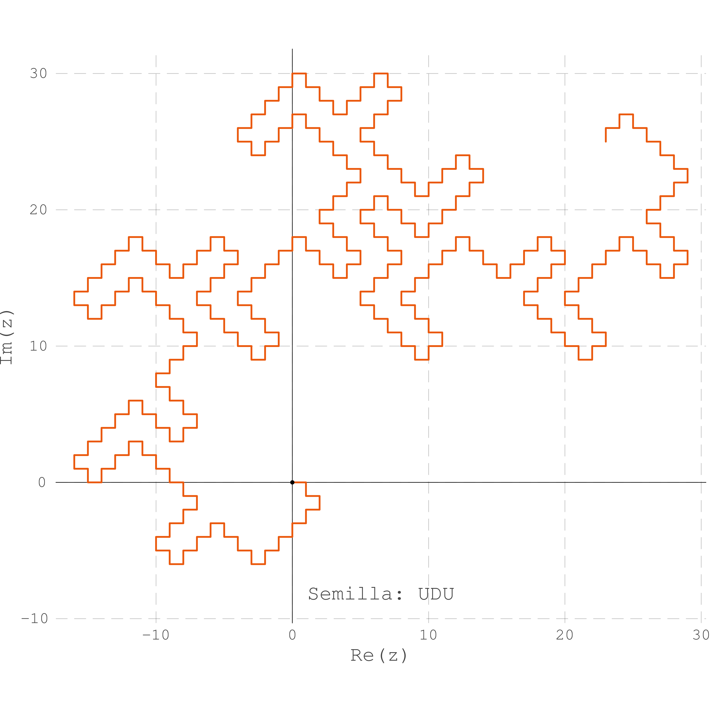
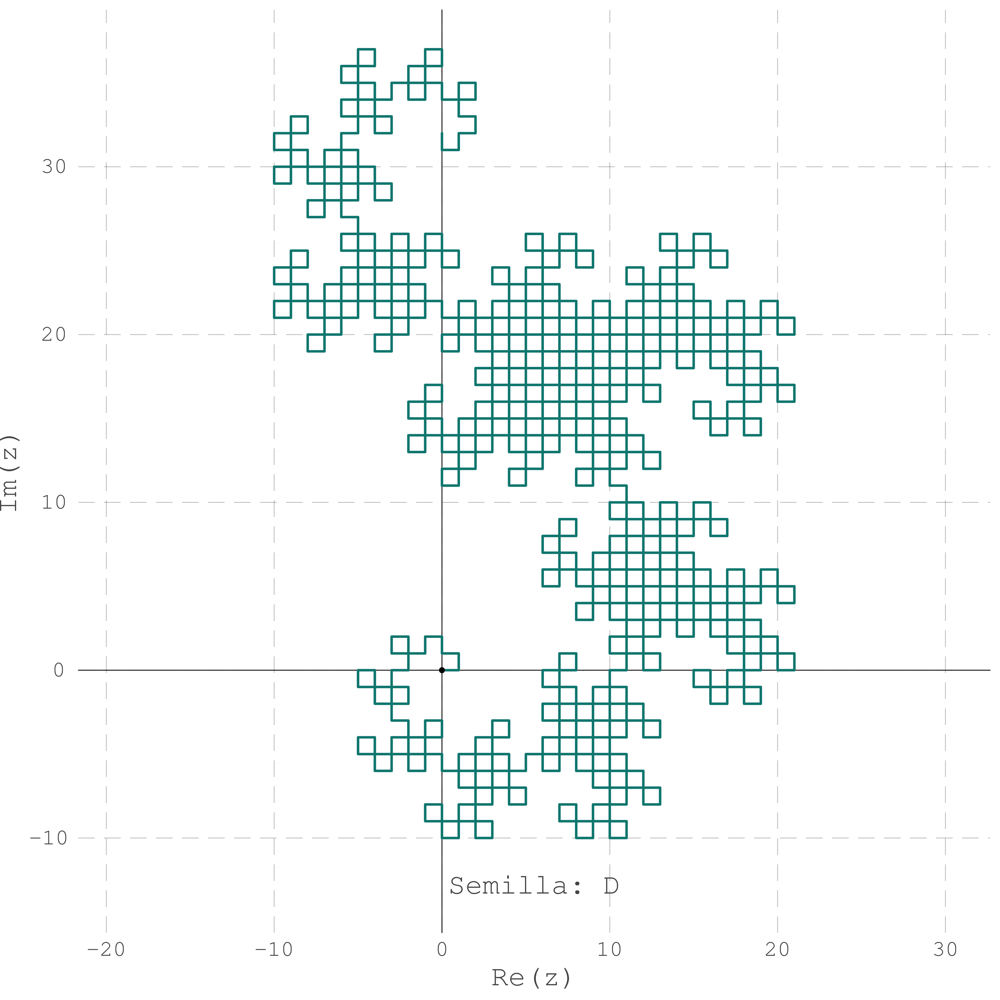
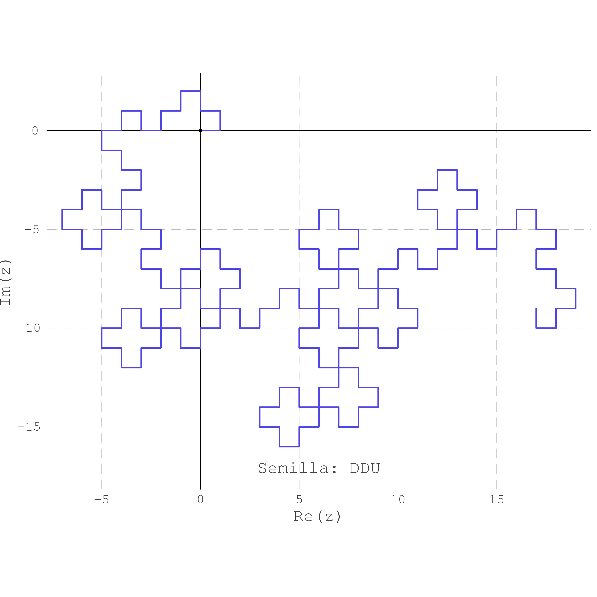

# Curvas del Dragón · ALTENCOA 11 (2026)

Repositorio de la ponencia **«Curvas del Dragón»**, presentada en ALTENCOA 11 (2026).

> Nota: el repositorio está en desarrollo.

## Índice

1. [Idea del proyecto](#idea-del-proyecto)
2. [Estructura del repositorio](#estructura-del-repositorio)
3. [Requisitos e instalación](#requisitos-e-instalación)
4. [Ejecución de los scripts](#ejecución-de-los-scripts)
5. [Dónde se guardan los datos](#dónde-se-guardan-los-datos)
6. [Galería de ejemplos](#galería-de-ejemplos)
7. [Estándar de terminal](#estándar-de-terminal)
8. [Licencia y autores](#licencia-y-autores)

---

## Idea del proyecto

Exploramos la **palabra del dragón**, la **curva de Heighway** y su tratamiento
categórico como coálgebra de un endofuntor, apoyándonos en herramientas
computacionales.

- **Palabra del dragón.** Palabras sobre el alfabeto `{D, U}`. Cada letra es un
  giro de la curva: `D` = giro de +90° y `U` = giro de −90°. La palabra clásica se
  construye recursivamente como `Sₙ₊₁ = Sₙ · D · S̄ₙᴿ`, donde `S̄ₙᴿ` es la inversa
  (leída al revés) con las letras intercambiadas.
- **Semillas.** Cambiar la semilla `S₁` (por ejemplo `UUDD` o `UDU`) genera
  distintas curvas. Hay dos definiciones equivalentes de la palabra:
  1. *Recurrencia directa:* `Sₙ₊₁ = Sₙ · S₁ · S̄ₙᴿ`.
  2. *Producto de plegado:* intercala `Sₙ` y `S̄ₙᴿ` con cada letra de `S₁`.
- **De la palabra a la curva.** Cada giro se acumula como ángulo y cada paso
  avanza una unidad en el plano complejo.
- **Propiedades.** Longitud de la palabra, no autointersección, palabra infinita
  de plegado, semillas generadoras y **teselación del plano** con 4 dragones
  rotados por `1, i, −1, −i`.
- **Perspectiva categórica.** La curva cumple la ecuación de autosemejanza
  `D = f₁(D) ∪ f₂(D)`. Se interpreta como una coálgebra del endofuntor de
  doblamiento `G(X) = X ∪_* X`, con `[0,1]` como coálgebra terminal (teorema de
  Freyd) y mapa de estructura isomorfo (lema de Lambek).

El guion de la ponencia está en [`docs/Temas.md`](docs/Temas.md).

## Estructura del repositorio

```
Curvas-de-dragon-ALTENCOA11-2026/
├── assets/                      # Imágenes generadas por los scripts
│   ├── basic-dragon/            #   ← dragon_curve.jl
│   ├── self-similar-dragon/     #   ← folding_dragon_curve.jl
│   ├── four-dragons/            #   ← four_dragons.jl
│   └── seed-curves/             #   ← seed_dragon_curve.jl
│       ├── first_definition/    #       método 1 (recurrencia directa)
│       └── second_definition/   #       método 2 (producto de plegado)
├── docs/
│   └── Temas.md                 # Guion de la ponencia
├── scripts/
│   ├── terminal_ui.jl           # Módulo común de estilo de terminal
│   ├── dragon_curve.jl          # Curva con gradiente de color
│   ├── folding_dragon_curve.jl  # Autosemejanza D = f₁(D) ∪ f₂(D)
│   ├── seed_dragon_curve.jl     # Curva a partir de una semilla
│   └── four_dragons.jl          # Teselado con 4 dragones
├── Project.toml
├── Manifest.toml
└── README.md
```

Las subcarpetas de `assets/` se crean automáticamente al ejecutar cada script.

## Requisitos e instalación

- [Julia](https://julialang.org/downloads/) ≥ 1.10 (el `Manifest.toml` se generó
  con Julia 1.12.6, que es la versión recomendada).
- Paquete usado por los scripts: [`Plots`](https://docs.juliaplots.org/) (backend GR).
  Se instala con el entorno del proyecto.

```bash
git clone https://github.com/spartan14799/Curvas-de-dragon-ALTENCOA11-2026.git
cd Curvas-de-dragon-ALTENCOA11-2026
julia --project=. -e 'using Pkg; Pkg.instantiate()'
```

## Ejecución de los scripts

Todos los comandos se ejecutan **desde la raíz del repositorio**, aunque las rutas
de salida no dependen del directorio de trabajo. Todos los scripts aceptan
`-h` / `--help` para mostrar su ayuda con el mismo formato.

```bash
julia --project=. scripts/<script>.jl --help
```

### `dragon_curve.jl` — curva con gradiente

Curva de Heighway con `2ⁿ` segmentos, coloreada con un gradiente a lo largo del trazo.

| Opción | Descripción | Defecto |
|---|---|---|
| `-i`, `--iter <int>` | Iteraciones `n` (`2ⁿ` segmentos) | `7` |
| `-t`, `--tam <int>` | Lado de la imagen en píxeles | `400` |
| `-o`, `--out <ruta>` | Archivo de salida | `assets/basic-dragon/curva_dragon_i<n>.png` |

```bash
julia --project=. scripts/dragon_curve.jl -i 12 -t 1200
```

### `folding_dragon_curve.jl` — autosemejanza

Divide el dragón por su punto medio en dos copias (`f₁(D)` y `f₂(D)`) de distinto
color y marca el punto de pegado.

| Opción | Descripción | Defecto |
|---|---|---|
| `-i`, `--iter <int>` | Iteraciones (≥ 2) | `10` |
| `-g`, `--grosor <float>` | Grosor de la línea | `2.5` |
| `-c1`, `--color1 <color>` | Color de la Copia 1 (HEX o nombre) | `#1d4ed8` |
| `-c2`, `--color2 <color>` | Color de la Copia 2 (HEX o nombre) | `#ea580c` |
| `-o`, `--out <ruta>` | Archivo de salida | `assets/self-similar-dragon/dragon_autosemejante_i<iter>.png` |

```bash
julia --project=. scripts/folding_dragon_curve.jl -i 12 -g 3.0
```

### `seed_dragon_curve.jl` — curva a partir de una semilla

Genera la palabra con la semilla y el método elegidos, y dibuja la curva con una
etiqueta de la semilla. Sin argumentos entra en **modo interactivo**.

| Opción | Descripción | Defecto |
|---|---|---|
| `-s`, `--seed <palabra>` | Semilla en `{D, U}` (ej. `UUDD`, `UDU`, `D`) | `UUDD` |
| `-i`, `--iter <int>` | Iteraciones | `6` |
| `-m`, `--metodo <1\|2>` | 1 = recurrencia directa, 2 = producto de plegado | `1` |
| `-p`, `--paleta <1-8>` | Color de la curva | `1` |
| `-e`, `--ejes <bool>` | Mostrar ejes y cuadrícula | `true` |
| `-g`, `--grosor <float>` | Grosor de la línea | `3.0` |
| `-o`, `--out <ruta>` | Archivo de salida | ver [datos](#dónde-se-guardan-los-datos) |

```bash
julia --project=. scripts/seed_dragon_curve.jl -s UDU -i 7 -m 1 -p 4 -e false
julia --project=. scripts/seed_dragon_curve.jl UDU 7 1 4 false   # modo posicional
```

Colores: `1` Azul Rey · `2` Azul Noche · `3` Azul Océano · `4` Naranja Intenso ·
`5` Naranja Ámbar · `6` Verde Teal · `7` Índigo · `8` Gris Pizarra.

### `four_dragons.jl` — teselado del plano

Dibuja el dragón clásico rotado por `1, i, −1, −i` (4 dragones). Sin argumentos
entra en **modo interactivo**.

| Opción | Descripción | Defecto |
|---|---|---|
| `-i`, `--iter <int>` | Iteraciones | `6` |
| `-e`, `--ejes <bool>` | Mostrar ejes y cuadrícula | `true` |
| `-p`, `--paleta <1-7>` | Paleta de colores | `1` |
| `-g`, `--grosor <float>` | Grosor de la línea | `5.0` |
| `-o`, `--out <ruta>` | Archivo de salida | `assets/four-dragons/mosaico_4dragones_i<iter>_p<paleta>[_sinejes].png` |

```bash
julia --project=. scripts/four_dragons.jl -i 8 -e false -p 7
julia --project=. scripts/four_dragons.jl 8 false 7   # modo posicional
```

Paletas: `1`–`4` monocromáticas (azul profundo, teal, índigo, pizarra) · `5` y `6`
bicromáticas (azul/naranja, marino/ámbar) · `7` cuadricromática azul y naranja.

## Dónde se guardan los datos

El proyecto no usa bases de datos ni archivos de entrada: **todo lo que se genera
son imágenes PNG**, que se guardan en `assets/`.

| Script | Carpeta de salida | Nombre del archivo |
|---|---|---|
| `dragon_curve.jl` | `assets/basic-dragon/` | `curva_dragon_i<n>.png` |
| `folding_dragon_curve.jl` | `assets/self-similar-dragon/` | `dragon_autosemejante_i<iter>.png` |
| `four_dragons.jl` | `assets/four-dragons/` | `mosaico_4dragones_i<iter>_p<paleta>[_sinejes].png` |
| `seed_dragon_curve.jl` (método 1) | `assets/seed-curves/first_definition/` | `curva_dragon_<SEMILLA>_i<iter>_p<color>[_sinejes].png` |
| `seed_dragon_curve.jl` (método 2) | `assets/seed-curves/second_definition/` | `curva_dragon_<SEMILLA>_i<iter>_p<color>[_sinejes].png` |

- El sufijo `_sinejes` aparece cuando se usa `--ejes false`.
- Con `--out <ruta>` puedes guardar la imagen en otro lugar.

## Galería de ejemplos

### Curva del dragón sencilla

<p align="center">
  
  <br>
  <sub><code>julia --project=. scripts/dragon_curve.jl -i 12 -p 1</code></sub>
</p>

### Teselado del plano

<p align="center">
  
  <br>
  <sub><code>julia --project=. scripts/four_dragons.jl -i 8 -e false -p 7</code></sub>
</p>

### Dragones generados por distintas semillas

<table>
  <tr>
    <td align="center">
      <br>
      <b>Semilla UUDD</b><br>
      <sub><code>scripts/seed_dragon_curve.jl -s UUDD -i 6 -p 1</code></sub>
    </td>
    <td align="center">
      <br>
      <b>Semilla UDU</b><br>
      <sub><code>scripts/seed_dragon_curve.jl -s UDU -i 7 -p 4</code></sub>
    </td>
  </tr>
  <tr>
    <td align="center">
      <br>
      <b>Semilla D</b><br>
      <sub><code>scripts/seed_dragon_curve.jl -s D -i 10 -p 6</code></sub>
    </td>
    <td align="center">
      <br>
      <b>Semilla DDU</b><br>
      <sub><code>scripts/seed_dragon_curve.jl -s DDU -i 6 -p 7</code></sub>
    </td>
  </tr>
</table>

## Estándar de terminal

Todos los scripts de `scripts/` comparten el módulo
[`terminal_ui.jl`](scripts/terminal_ui.jl), así que se ven y se usan igual:

- **Banner** de apertura con el nombre del script.
- **Secciones** (`> Parámetros`, `> Generación`) con línea separadora.
- **Parámetros** alineados en columna y **pasos** numerados `[1/3]`.
- **Mensajes etiquetados:** `[INFO]`, `[ OK ]`, `[WARN]`, `[FAIL]`.
- **Cierre** con la ruta del archivo guardado (relativa a la raíz) y el tiempo.
- **Ayuda** `-h` / `--help` con el mismo formato (uso, opciones, catálogos, ejemplos).
- **Errores claros** si una opción es desconocida o un valor no es válido.
- **Sin color** automáticamente si la salida no es una terminal o si existe la
  variable de entorno `NO_COLOR`.

Para crear un script nuevo con el mismo estilo:

```julia
include(joinpath(@__DIR__, "terminal_ui.jl"))
using .TerminalUI

banner("Mi nuevo script")
seccion("Parámetros")
parametros("Iteraciones" => 8, "Salida" => "assets/mi-carpeta")
paso(1, 2, "Calculando")
# ...
msg_resultado(ruta_assets("mi-carpeta", "salida.png"))
```

## Licencia y autores

Este proyecto se distribuye bajo la licencia MIT.

### Autores

```
Juan Esteban Huertas Serrano – Universidad Nacional de Colombia
Alejandro Manrique Roca – Pontificia Universidad Javeriana
```

ALTENCOA 11 – 2026
